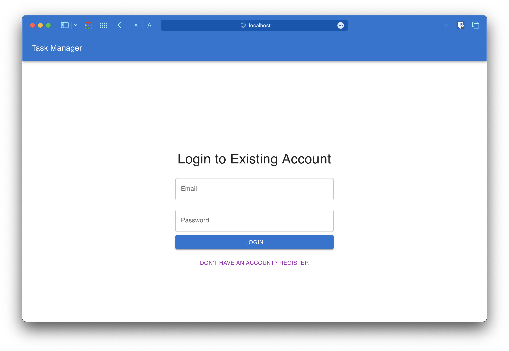
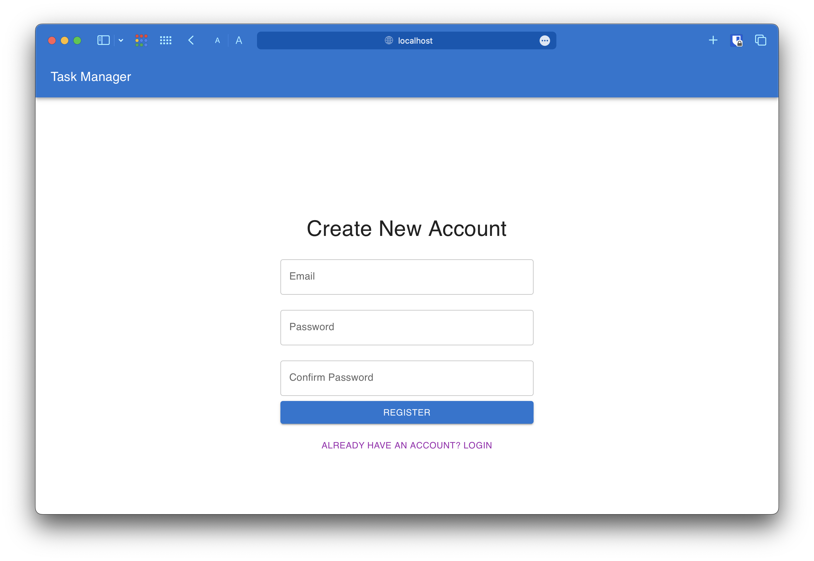
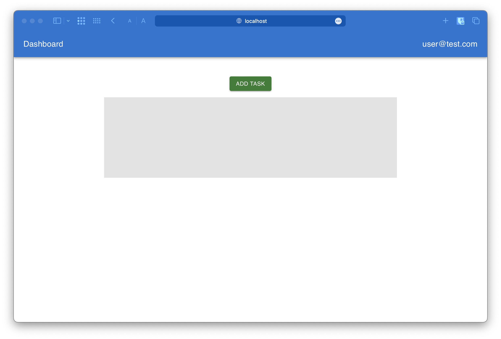
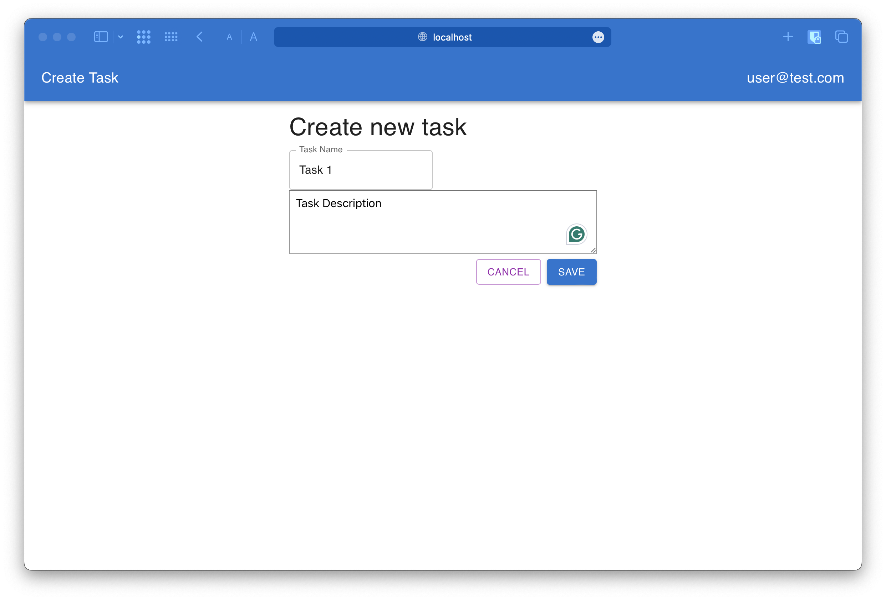
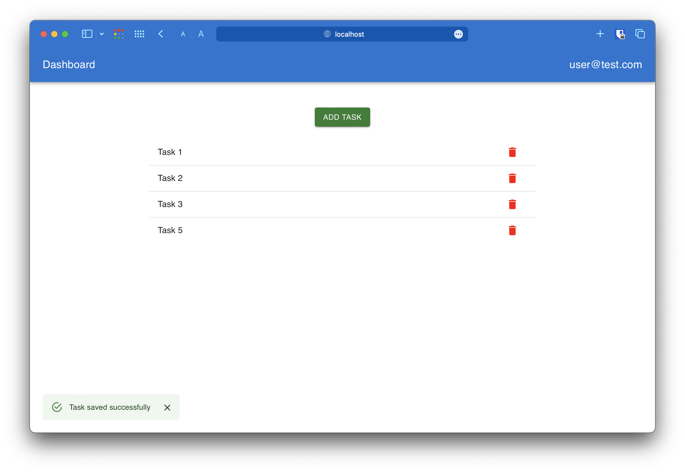
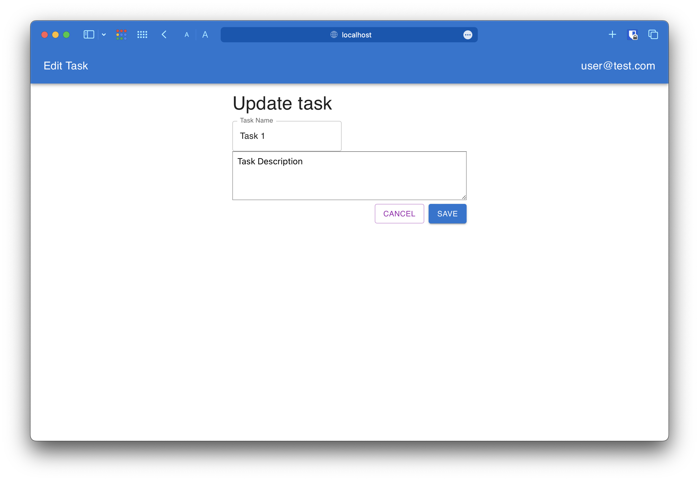
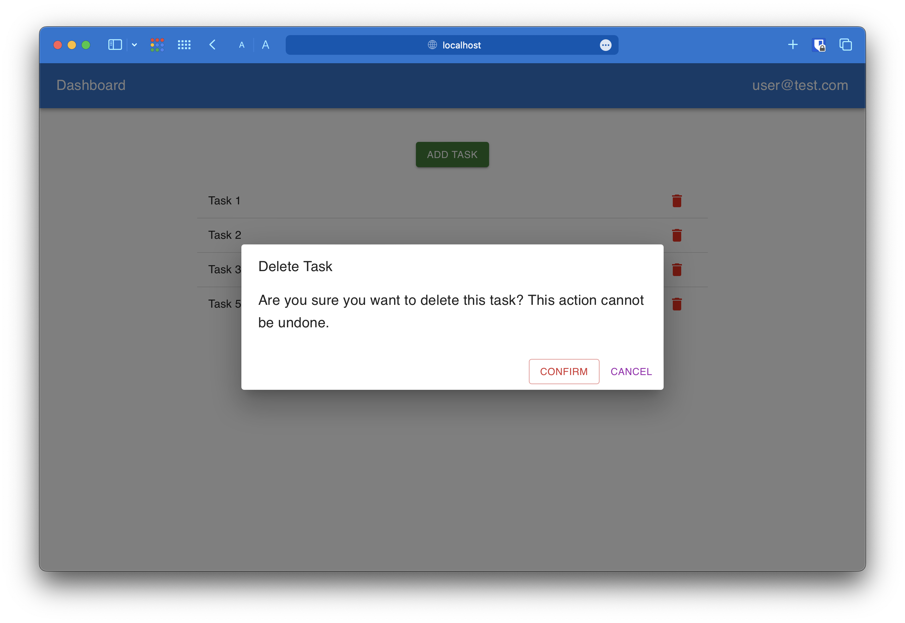
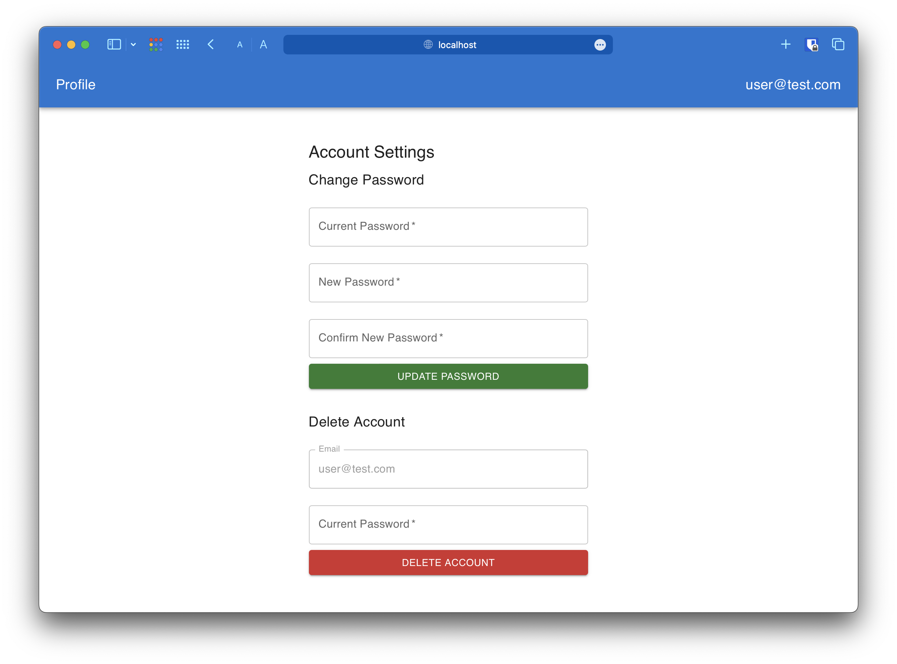

# diff_backend_edu

A comparative analysis of backend implementations for a Task Management System using various technologies.

<!-- TOC -->

* [diff_backend_edu](#diff_backend_edu)
  * [Project Overview](#project-overview)
    * [Task Management System: Backend Comparison](#task-management-system-backend-comparison)
    * [Backend Implementations](#backend-implementations)
  * [Skeleton Project Setup](#skeleton-project-setup)
    * [Java + Spring Boot](#java--spring-boot)
    * [Node.js + Express.js](#nodejs--expressjs)
    * [Python + Django](#python--django)
    * [GoLang + Gin](#golang--gin)
  * [Common API Description for All Backend Services](#common-api-description-for-all-backend-services)
    * [User Management REST Controller](#user-management-rest-controller)
      * [Example Request and Response Payloads](#example-request-and-response-payloads)
    * [Task Management REST Controller](#task-management-rest-controller)
      * [Example Request and Response Payloads](#example-request-and-response-payloads-1)
    * [Authentication REST Controller](#authentication-rest-controller)
      * [Example Request and Response Payloads](#example-request-and-response-payloads-2)
  * [Frontend Screens of the App](#frontend-screens-of-the-app)
    * [Login Screen](#login-screen)
    * [Registration Screen](#registration-screen)
    * [Dashboard Screen](#dashboard-screen)
    * [Create Task Screen](#create-task-screen)
    * [Dashboard After Creating Several Tasks](#dashboard-after-creating-several-tasks)
    * [Update Task Screen](#update-task-screen)
    * [Delete Task Confirmation on the Dashboard](#delete-task-confirmation-on-the-dashboard)
    * [Profile Screen](#profile-screen)

<!-- TOC -->

## Project Overview

### Task Management System: Backend Comparison

This project aims to compare different backend technologies by implementing the same Task Management System (TMS)
functionality. The system includes user registration, login, and basic task operations (create, read, update, delete).
The frontend is a Single Page Application (SPA) developed with TypeScript and ReactJS, while the backend is implemented
in multiple frameworks and languages. This allows for an evaluation of each technology's ease of use, performance, and
overall strengths and weaknesses.

### Backend Implementations

The backend is developed using the following technologies:

1. **Java + Spring Boot**
2. **Node.js + Express.js**
3. **Python + Django**
4. **GoLang + Gin**

Each implementation will support:

- User registration and login with JWT-based authentication
- Basic CRUD operations for task management

This project is educational in nature, designed to highlight the pros and cons of each backend framework.

---

## Skeleton Project Setup

### Java + Spring Boot

Skeleton generated using [spring.io](https://start.spring.io).

### Node.js + Express.js

Skeleton created using the [Express.js generator](https://www.npmjs.com/package/express-generator-typescript):

```bash
npx express-generator-typescript .
```

### Python + Django

Skeleton created using PipEnv and Django Admin:

```bash
pipenv install django
django-admin startproject django_backend .
```

### GoLang + Gin

Skeleton setup with Go modules:

```bash
go mod init go_backend
touch main.go
```

---

This repository provides a comprehensive comparison of backend technologies in real-world task management applications.

---

## Common API Description for All Backend Services

The following API endpoints should be implemented via different technologies:

### User Management REST Controller

| HTTP Method | Path                            | Description                                                     |
|-------------|---------------------------------|-----------------------------------------------------------------|
| PUT         | /api/v1/users/{userId}/password | Updates the password for the authenticated user.                |
| GET         | /api/v1/users/{userId}          | Retrieves the details of the authenticated user using their ID. |
| POST        | /api/v1/users/{userId}/delete   | Deletes the authenticated user account from the system.         |

#### Example Request and Response Payloads

1. **Update User Password**

- **Request**
  ```json
  {
    "currentPassword": "P@ssw0rd",
    "newPassword": "N3wP@ssw0rd",
    "newPasswordConfirmation": "N3wP@ssw0rd"
  }
  ```

- **Response**
  ```json
  {
    "statusCode": 200,
    "statusMessage": "OK",
    "data": {
      "userId": 1,
      "email": "user@example.com",
      "jwtToken": "eyJhbGciOiJIUzI1NiIsInR5cCI6IkpXVCJ9..."
    },
    "error": null
  }
  ```

2. **Fetch User Details**

- **Request** (GET request, no body required)

- **Response**
  ```json
  {
    "statusCode": 200,
    "statusMessage": "OK",
    "data": {
      "userId": 1,
      "email": "user@example.com",
      "jwtToken": "eyJhbGciOiJIUzI1NiIsInR5cCI6IkpXVCJ9..."
    },
    "error": null
  }
  ```

3. **Delete User Account**

- **Request**
  ```json
  {
    "email": "user@example.com",
    "currentPassword": "P@ssw0rd"
  }
  ```

- **Response**
  ```json
  {
    "statusCode": 200,
    "statusMessage": "OK",
    "data": {},
    "error": null
  }
  ```

---

### Task Management REST Controller

| HTTP Method | Path                                  | Description                                                     |
|-------------|---------------------------------------|-----------------------------------------------------------------|
| GET         | /api/v1/users/{userId}/tasks          | Retrieves all tasks for the authenticated user.                 |
| POST        | /api/v1/users/{userId}/tasks/         | Creates a new task for the authenticated user.                  |
| GET         | /api/v1/users/{userId}/tasks/{taskId} | Retrieves a specific task by its ID for the authenticated user. |
| PUT         | /api/v1/users/{userId}/tasks/{taskId} | Updates an existing task for the authenticated user.            |
| DELETE      | /api/v1/users/{userId}/tasks/{taskId} | Deletes a specific task by its ID for the authenticated user.   |

#### Example Request and Response Payloads

1. **Retrieve All Tasks**

- **Request** (GET request, no body required)

- **Response**
  ```json
  {
    "statusCode": 200,
    "statusMessage": "OK",
    "data": [
      {
        "taskId": 1,
        "name": "Implement OpenAPI Documentation",
        "description": "This task involves creating OpenAPI documentation for the Spring Boot application.",
        "userId": 123
      }
    ],
    "error": null
  }
  ```

2. **Create New Task**

- **Request**
  ```json
  {
    "name": "Develop User Authentication Module",
    "description": "This task involves developing the user authentication module for the application."
  }
  ```

- **Response**
  ```json
  {
    "statusCode": 200,
    "statusMessage": "OK",
    "data": {
      "taskId": 2,
      "name": "Develop User Authentication Module",
      "description": "This task involves developing the user authentication module for the application.",
      "userId": 123
    },
    "error": null
  }
  ```

3. **Retrieve Task by ID**

- **Request** (GET request, no body required)

- **Response**
  ```json
  {
    "statusCode": 200,
    "statusMessage": "OK",
    "data": {
      "taskId": 1,
      "name": "Implement OpenAPI Documentation",
      "description": "This task involves creating OpenAPI documentation for the Spring Boot application.",
      "userId": 123
    },
    "error": null
  }
  ```

4. **Update Task**

- **Request**
  ```json
  {
    "name": "Revise User Authentication Module",
    "description": "This task involves revising the user authentication module to improve security."
  }
  ```

- **Response**
  ```json
  {
    "statusCode": 200,
    "statusMessage": "OK",
    "data": {
      "taskId": 1,
      "name": "Revise User Authentication Module",
      "description": "This task involves revising the user authentication module to improve security.",
      "userId": 123
    },
    "error": null
  }
  ```

5. **Delete Task**

- **Request** (DELETE request, no body required)

- **Response**
  ```json
  {
    "statusCode": 200,
    "statusMessage": "OK",
    "data": {},
    "error": null
  }
  ```

---

### Authentication REST Controller

| HTTP Method | Path                  | Description                                                         |
|-------------|-----------------------|---------------------------------------------------------------------|
| POST        | /api/v1/auth/register | Handles user re gistration by  creating a new user account.         |
| POST        | /api/v1/auth/login    | Handles user lo---------------ting the provided email and password. |

#### Example Request and Response Payloads

1. **User Registration* *

- **Request**
  ```json
  {
    "email": "user@example.com",
    "password": "P@ssw0rd",
    "passwordCon  firmation": "P@ssw0rd"
  }
  ```

- **Response**
  ```json
  {
    "statusCode": 200,
    "statusMessage": "OK",
    "data": {
      "userId": 1,
      "email": "user@example.com",
      "jwtToken": "eyJhbGciOiJIUzI1NiIsInR5cCI6IkpXVCJ9..."
    },
    "error": null
  }
  ```

2. **User Login**

- **Request**
  ```json
  {
    "email": "user@example.com",
    "password": "P@ssw0rd"
  }
  ```

- **Response**
  ```json
  {
    "statusCode": 200,
    "statusMessage": "OK",
    "data": {
      "userId": 1,
      "email": "user@example.com",
      "jwtToken": "eyJhbGciOiJIUzI1NiIsInR5cCI6IkpXVCJ9..."
    },
    "error": null
  }
  ```

---

## Frontend Screens of the App

### Login Screen



### Registration Screen



### Dashboard Screen



### Create Task Screen



### Dashboard After Creating Several Tasks



### Update Task Screen



### Delete Task Confirmation on the Dashboard



### Profile Screen

To access the profile, click on the email address located on the right side of the application toolbar.

